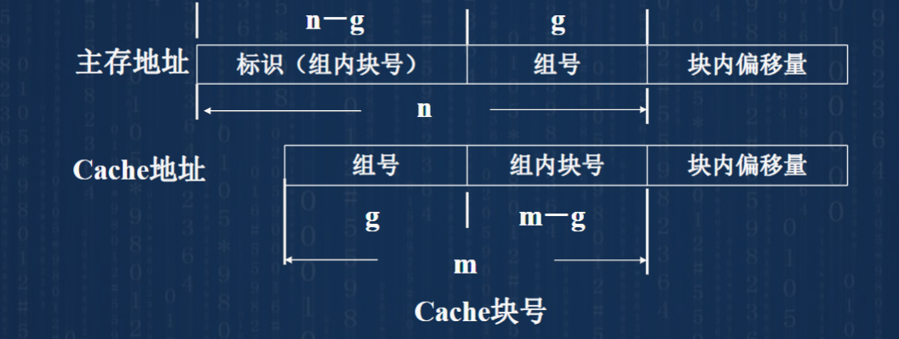

# 第二章 数据信息表示与运算
## 原码表示：
- 原码移位：**符号位不变**，数值位左右移，补0。
## 补码表示：
- 补码0唯一：0.000000...
- 机器正负数转换：
    1. $[x]_补$称为机器正数；$[-x]_补$称为机器负数。
    
    2. 计算机器负数$[-x]_补$：将$[x]_补所有位（包括符号位）取反加1$

- 补码右移：符号位不变，高位补符号
- 补码左移：连符号位一起左移，低位补0。**如果移位导致符号位改变就说明移除了有效位，出错。**

- 两补码位数不同不能相互加减，要扩展到相同位。
## 移码表示：
- 移码0：10000...，唯一
- 移码 = 补码 + 符号位取反
- 移码无论正负，都可以直接按照无符号数比较大小。

## 定点表示
小数点位置不变
- 定点小数：$x_{阶码}.x1x2x3$
- 定点整数：$x_{阶码}x1x2x3._{隐含}$
### 表示范围：
- 原码、反码：
    - 最大正数:0 1111111,$2^{n}-1$;0.1111111,$1-2^{-n}$
    - 最大负数:1 0000001,$-1$;1.0000001,$-2^{-n}$
    - 最小正数:0 0000001,$1$;0.00000001,$2^{-n}$
    - 最小负数:1 1111111,$-2^{n}+1$;1.1111111,$1-2^{-n}$
- 补码：
    - 最大负数:1 1111111,$-1和2^{-n}$
    - 最小负数:1 0000000,$-2^n和-1(定点小数)$。对于补码-1(纯小数1.0000000)、$-2^n$(纯整数1000000)的首位1既表示符号位也表示数值。
- 移码：符号位也取反的补码.可以表示到-1(0.000...)和$-2^n$(000000...j)
### 溢出定义
- 上溢出:**小于最小负数**或**大于最大整数**
- 下溢出:**大于最大负数**且**小于最小正数**，即机器零位置
- 正溢出:大于最大正数
- 负溢出:小于最小负数
### 分辨率
相邻两点的距离。定点整数1，定点小数$2^-n$
### 定点机
仅支持定点表示的机器
### 定点加减法
- 加法
$[x]_补+[y]_补=[x+y]_补$
- 减法
$[x]_补-[y]_补=$**$[x]_补+[-y]_补$**$=[x-y]_补$
- 符号位同时参与计算，若进位超过模则丢模。
- 溢出：
    - xy相互异号不溢出
    - xy同号，若结果符号与xy不同则溢出。
    - $溢出判断OVR = s_0 异或 x_0 异或 y_0 = 符号位进位 异或 最高位进位$
- 变形补码运算
符号位使用两位，如00 00000010。**无论是否溢出，最左侧符号永远正确**。
    - 设两个符号位为$s_{f1},s_{f2}$,则$OVR=s_{f1} 异或 s_{f2}$
    - 00/11 ：未溢出
    - 01 ：00 的最高位进位，而$s_{f1}未进位，正溢出$
    - 10 ：11 的最高位未进位，而$s_{f2}$变为0，负溢出$

### 定点乘法
- 设乘积符号为$z_f$，则$z_f = x_f 异或 y_f$。
- **两个n位数相乘，得到2n位乘积**
- **原码乘法**：
     单符号位，绝对值运算 
    1. 计算符号位
    2. 初始部分积为0，连接上乘数y的绝对值部分（被乘数作为x），从乘数最低位开始，如果是1则部分积+x；如果是0则不加。
    3. 右移部分积和乘数
    4. 重复2、3
    
- **补码乘法(布斯乘法)**：
     被乘数双符号位，乘数单符号位，原值运算 
    xy均以补码表示，且需要双符号位。带符号位共n+2位。
    1. 初始部分积(n+2位)为0，连接上乘数y(n+1+1=n+2位)，且y的最低位再加上一位0，即$y_{n+1}=0$
    2. 用$y_n$和$y_{n+1}$作为判别位，$(y_{n+1}-y_{n}) * x$加上部分积，即两判别位00、11时，加0；01时，加$x_补$；10时，加$[-x]_补$。
    3. 右移部分积和y
    4. 重复n+1次2、3，**但最后一次不用移位**,得到2n位则结束
    
### 定点除法
**整数除法中被除数>除数，结果>1。而小数除法中被除数<除数，结果<1**。对于整数除法，要求被除数2n位，除数n位，且被除数高n位小于除数n位，否则溢出。
- 原码除法
     双符号位，绝对值运算 
    原码的减法利用补码加减，$x-y = x + [-y]_补$
    - 原码恢复余数法:
        采用双符号位
        1. 判溢出，要求被除数>除数，结果>1。而小数除法中被除数<除数，结果<1
        2. 计算结果符号$s_f = x_0 \oplus y_0$。并将除数和被除数变为绝对值。
        3. 被除数 - 除数，余数为正则够减，最右位上商为1，余数拼接上商整体**左移**一位；若余数为负则不够减，相应位上商为0，将除数加回余数，余数上商左移一位。
        4. 重复3直到求出精确度为止。
        5. 最后的余数需要乘以$2^{-n}$才是真正的余数，即右移n次
        
    - 原码不恢复余数法(加减交替法)
        原理：当余数<0时，**加除数再左移和在上一步减去除数前先左移再加是相同的**
        1. 判溢出
        2. 计算结果符号
        3. 被除数 - 除数。
        4. 如果余数>0，则上商为1，左移再减除数。如果余数<0，则上商为0，左移再加上除数。
        5. 重复4步骤n次，计算得到n位结果，如果最后一次余数仍然是负数，则需要再加上一个除数，得到余数。余数需要乘$2^{-n}$
        
- 补码除法
    1. 判断够不够减：xy同号则$[x]_补-[y]_补$，xy异号则$[x]_补+[y]_补$。
    2. 第一步先按1中加减。之后若余数与除数同号则上商1，左移后-$[y]_补$；若余数与除数异号则上商0，左移+$[y]_补$
    3. 商矫正(上商按反码，需要+1)：
        - 末位恒置1
        - 除尽了：
            1. 除数正不矫正
            2. 除数负则最低位+1
        - 除不尽：
            1. 商为正不矫正
            2. 商为负最低位+1
    
        
## 浮点表示
- 规格化：为了最大化精度且使浮点表示唯一化
    - 将S尾数中的第一位数字变为1，即$\frac{1}{2} \leq |S| < 1$。例如将$0.00101 * 2^{-5} 变为 0.101 * 2 {-7}$
    - 原码表示的规格化数$S_f.1S_2...$，其中要求$S_1=1$
    - 补码表示的规格化数S要求：**$S_f \oplus S_1 = 1$**，即符号位和第一位不相同。$1.0xxx$和$0.1xxx$
    
- 阶码m和尾数n位数的选择：
    - **阶码m位数越大，数表示范围越大**
    - **尾数n位数越大，数的精确度越高**
    - 单精度表示：用单字长表示；双精度：用双字长表示。
- 机器零：
    1. 尾数全0，无论阶码；
    2. 阶码小于最小阶码，$e<2^{-m}$，无论尾数。例如当使用补码表示时，阶码可能是$2^{-m}$（类似-128），则无论尾数都是0.
    3. 阶码是最小值时视为机器零，所以当**阶码采用移码、尾数采用补码时**，机器零表示全0.此时，对于非规格化数$00 000...000...1$最小，小于此数都是机器零；规格化数$00 000...100...$最小，小于此数都是机器零。
### IEEE754标准
![IEEE754]](image-4.png)
- 32位浮点数：
    - 1位数符S，8位阶码E，23位尾数M。表示了$(-1)^S×1.M×2^{E-127}$。
    - 即数符表示正负、阶码默认移127码表示（即阶码 = 127 + 实际阶;规定阶码在1-254,0和255用作特殊用途；实际阶范围-126-127）、尾数默认原码，由于规格化表示，默认小数点左侧有1，实际尾数24位。
    - 如下图所示，为了避免绝对值较小的数字下溢，允许使用E=0时的非规格化数来进行表示,**但此时小数点左侧隐含0，阶码位-126而不是0-127=-127**。
    - 
- 64位浮点数：1位S，11位E，52位M
### 浮点计算：
浮点计算时，阶码和尾数分开进行，规格化的计算精度更高，一般采用规格化计算。
- 规格化加减计算：
    $x = S_x × 2^{e_x}$
    $y = S_y × 2^{e_y}$
    先转换为机器数，看清补码还是原码。
    1. 对阶：两数阶码要相等。首先计算$\delta e = e_x-e_y$,然后使小阶向大阶对齐移位，将阶码小的尾数S向右位移$|\delta|位$
    2. 尾数求和/差。若溢出则需要右移解决溢出。
    3. 将结果规格化：为方便判断可以使用变补，两位符号位
        - 向左破坏规格化：尾数结果溢出；向右规格化，右移,**每移一位阶码都要+1**。
        - 向右破坏规格化：尾数没有溢出，但不满足规格化数要求。向左规格化，左移，**每移一位阶码-1**
        - 浮点计算中，通过规格化将不会影响运算结果。
    4. 舍入：防止阶码和尾数右移时丢失精度。
        - 截断法（恒舍法）：丢掉的全部舍去
        - 0舍1入法：被舍弃的最高位是0则舍去，是1则在右移后最低位+1。精度高但效率低。对于补码：
            1. 若舍去全为0，则不舍入
            2. 若舍去为0xxxx（xxxx不全为0）或100000...时，舍去丢失位上的值
            3. 若舍去为1xxxx时，舍去后入1
        - 末位置1法（冯诺依曼舍入法），无论怎样末位都置1，快但精度低。
        - 查表舍入法：制作ROM表舍入
    5. 溢出：看阶码是否上/下溢。下溢：当作机器零处理；**一般浮点数溢出是指上溢**。
    
- 规格化乘除计算：
    - 乘法：尾数相乘，阶码相加;除法：尾数相除，阶码相减。要求$|被除数| < |除数|$。
    - 在尾数乘除后，如果非规格化则需要规格化。**在右规时如果出现阶码上溢，则必须要转入溢出处理**。
- 阶码运算：
    1. 若阶码用移码表示，则移码相加后需要**将符号位取反**，得到结果的移码；加减时，也可以**将加数或减数的符号位取反(即+补码和+(-补码))**再计算。
    2. 使用双符号位计算移码，**初始规定$S_{f1} = 0$**，则当计算后$S_{f1}$为0时未溢出，当$S_{f1}$为1时溢出了。10上溢，11下溢，00负数，01正数。

##数据存储
存储非数值型数据。
- 逻辑数：与或非，按位进行，表示是非01关系
- 字符与字符串：
    - ACSII:
        1. 7位二进制数字表示128个符号，包括0-9、a-z、A-Z、符号和控制符，包括$b_{6-4}$高位部分和$b_{3-0}$低位部分。
        2. 通常一个字节（8位）表示一个字符，7位ASCII码最高位的作用是：奇偶校验位；表示字符，用于扩展ASCII；表明汉字。
        3. 
    - 汉字
        1. 
        2. 汉字输入码：音码（拼音）；形码（五笔）。
        3. 汉字交换码：国标码，用两个字节表示，每个字节只使用低7位。区号（49）位号（07）拼接（49 07），转换为两个8位二进制数（只使用低7位00110001 00000111），分别加上32（00100000），变为国标码（5127H）
        4. 汉字机内码：国标码的两个最高位置1，可以用于存储和读取字形码
        5. 汉字字形码：点阵、矢量码
## 数据长度和存储方式
- 数据长度：
    1. 位:一个0/1，一bit比特
    2. 字节：8位，Byte
    3. 字：
        - 在计算机系统中能被**同时存取和操作的一组二进制数**；
        - 字长：计算机中的字的二进制位数，**反映了CPU内部数据通道的宽度**。现在是4/8字节处理器，即32和64位处理器。一般来说，字长越长精度越高，且计算速度越快。
- C语言中的数据：
    - (unsigned)short/int/long；在数字后面加u表示无符号数，12345u；采用补码表示。可以通过不同解释方法来输出不同内容，例如带符号数-1的补码位11111111 11111111......，则通过输出无符号整数会输出$2^32-1$(32位机器中)
    - char：表示字符，用ASCII表示，8位，一个字节，可以表示字符和8位整数
    - 一个表达式中同时含有带符号数和无符号数，解释器会强制全部转换为无符号数进行运算。
    - char：8bit；short、int最少16bit；long最少32bit；short<int<long
    
    - 类型转换
        1. 带符号数和无符号数的转换，有意想不到的结果
        2. int转换为float时，**float尾数不够可能导致舍入**。转换为double精度更高。
        3. double转换为float时，数据可能溢出，且尾数可能被舍入
        4. float或doube转换为int时，舍入或溢出
        - 注意：double + float - double可能会导致对阶的时候溢出，不像Java会强制转换为double
- 存储方式
    - 需要制定最高有效位MSB（符号位）和最低有效位LSB（最低位）。有字节存储顺序。
    - 大端排序方式：在主存中的最低存储位置（开始地址，如1000H）存储一个数字的最高有效位，从高到低存储。即MSB存储在低地址，LSB存储在高地址。
    - 小端排序方式：LSB存储在低地址单元，MSB存储在高地址单元。
    存储数字时要知道，二进制数字左侧是高位置，存储方式是$b_6b_5...b_1b_0$
    

## 校验码
具有检测某些错误或带有自动纠正错误能力的数据编码方式。
- 码距和数据校验码：
    - 码距：
        1. 编码的距离：通常指一组编码中，**任何两个编码之间代码不同的位数**称为这两个编码的距离，也称海明距离
        2. 码距：**一组编码中的最小距离**
        - 例：1001和1011只有一位不同，（海明）距离为1；一组编码使用0000-1111这16个编码，每个相邻编码之间只有1位不同，**码距为1，任何出错时都会变为合法编码，没有纠错能力**
    - 校验码：
        1. 在正常编码下增加特殊规则的**校验位**，**增大码距来进行校验**。要
        2. 要检查e位错误，需要e+1码距
        3. 修正错误时只需要取反。修正t位错误需要2t+1码距。原因：发生t位错误后，非法编码距离合法仍差t距离，可以唯一确定错误位置。
### 奇偶校验码
在有效编码的**最高位前或最低位后**增加一位P。
- 奇校验：加上P后，1的个数为奇数。
- 偶校验：加上P后，1的个数为偶数。可以使用n位异或元件。如共7位有效位，加上P为8位，则$Peven = P_6 \oplus P_5 ... \oplus P_0 \oplus P;Podd = Peven取反$
### 海明校验码
在奇偶校验码的基础上额外增加校验位，以便**检测和纠正**(只能纠正一位错误)。设有效位为n，校验位为k，要达到**错1纠1**，**要满足$2^k \geq n + k + 1$**
- 编码方式：
    1. n位有效位，k位校验码。按照$2^k \geq n + k + 1$寻找最小k。构成一个n+k位编码。
    2. 设编码为$C_1C_2...C_{n+k}$，则所有校验码P位于$2^i，i:[0,k-1]$。
    3. 每一个有效位A都被至少两个校验位P校验；**被校验的位号=某些校验位号之和** 
    4. 例：
        1. n=7,则k=4；则编码时有$P_1P_2A_6P_4A_5A_4A_3P_8A_2A_1A_0$
        2. $A_6$的位号为3，3=1+2，则$A_6$被$P_1P_2$校验...
        3. 得到校验组：
        4. **每组的每个有效位进行异或，可以得到$P_keven$或$P_kodd$**，注意异或的个数对奇偶校验的影响:奇数个异或起来为even，偶数个异或起来反even（odd）
- 校验方式：
    1. k位校验码形成“指误字”：$P_kP_{k-1}...P_1$。若$P_i$组**检验成功则为0，否则为1**.
    2. 全0则无错。若非全0，则**指误字对应十进制代码就是出错位置**。
- 扩展的海明校验码：检2纠1，在最高位增加一个$P_0$，表示$n+k$位一共有多少个1，进行奇偶校验。检验时，先异或全部位，判断$E_0$是否通过检验；再去除$E_0和P_0进行分组检验$。

- 码距$d \geq e + t + 1$时，可以检e位错，纠t位错。
### 循环冗余CRC码
在模2运算下的多项式运算检验码。
- 模2运算
    1. 加减：即异或运算
    2. 模2乘：模2加求部分积之和，不进位:
    3. 模2除：模2减求部分余数，部分余数（最初是被除数）最高位为1，则上商为1；最高位为0上商为0；去掉最高位继续运算；直到被除数位数小于除数。
- 编码规则：
    1. 将待编n位码$C_{n-1}C_{n-2}...C_1C_0$编为多项式：$C_{n-1}x^{n-1} + C_{n-2}x^{n-2} ...C_0*x^0$。例如：$M(x) = 1001 = x^3 + 1$
    2. 选择一个k+1位码作为**约定除数**（**生成多项式**。例：$G(x) = 1011 = x^3+x+1$；要求：
        1. 任何位出错后，除$G(x)$后都不能使余数是0。
        2. 每个位出错后，余数不能相同
        3. 对余数循环除G(x)要能够循环
    3. 将M(x)左移k位(为了后续加R(x)时直接拼接)，得到了$M(x) × x^k$ ，计算$\frac{M(x)x^k}{G(x)}$，得到一个余数$R(x)$
    4. 将$M(x)x^k$与$R(x)$相加，得到循环冗余码CRC。则CRC码一定能整除G(x)
- 检验规则：收到的CRC与G(x)相除，余数为0则正确、余数不为0则需要根据余数纠正。出错位置index如表所示。
- 机器设计：若$\frac{M(x) x^k}{G(x)} $余数不为0，则反复在余数最后加0，继续除G(x)。同时每除一次，将CRC左移一位。出现最高位错误码后说明最高位出现了错误，取反即可。反复循环除并左移一个周期(n+k)次即可。

# 第三章 存储层次与系统
## 概述
存储器：存放程序(instructions)和数据(data)
### 存储器分类
- 按照与CPU的关系来分类：
    1. 主存储器：CPU直接访问，内存/主存，存放当前使用的程序和数据。
    2. 辅助存储器：外部设备，外存/辅存。
    3. 高速缓冲存储器(Cache)：主存和cpu之间的高速小容量存储器。
- 按照存取方式分类：
    1. 随机存取存储器RAM：任何数据都可以**按照地址随机存取**，主要用于主存
    2. 只读存储器ROM：只能随机读取，而不能读入。可以作为主存一部分。
    3. 顺序存储存储器SAM：排列、寻址、读写都是顺序的，如磁带。
    4. 直接存取存储器DAM：介于SAM和RAM，半顺序，如磁盘。
- 存储介质：半导体存储器、磁表面存储器、光介质存储器。
### 层次结构

- 从上到下
    - 访问时间依次增长
    - 存储容量依次增大
    - 存储器每位价格依次增大
- 传统三级层次：
    - Cache-主存层次：**速度问题**，将主存和Cache构成统一，Cache速度、主存价格、容量
    - 主存-辅存层次：**容量问题**，大量数据存储在辅存中，使用时成批放入主存。
### 主存的组成和操作

1. 存储阵列(存储体)的单元编码：每个存储单元的的地址统一编码，**地址码**。
    - 编址单位：字或字节(常用)。一个32位的字存储单元可以存储4字节；按字节编址时，占用4个字节地址。
    - 地址寄存器：保存需要读取的数据的地址，通过**地址总线**写入。
    - 地址译码与驱动电路：译出地址寄存器的地址，通过对应**地址选择线**选择相应地址，并提供驱动信号进行读写。
    - 读写电路：根据CPU控制读写
    - 数据寄存器：暂存要读写的数据。**是存储器与计算机其它功能部件联系的桥梁**
    - 时序控制电路：接受CPU的读写要求，输出时序信号来完成存取。如果采用异步时序电路，则完成后回发MFC（存储器操作完成）信号。
2. 存储器基本操作:
    主存储器存放CPU正在运行的程序和数据。
    - 
    - 
    - MAR：地址寄存器memory address register。MDR：数据寄存器memory data register;AB:address bus地址总线；CB:Control Bus控制总线；DB:Data Bus数据总线。
3. 异步/同步：同步在一个存取周期内完成(常用)；异步需要发MFC信号，但可采用不同速率的存储器作为主存。
### 存储器性能指标：
1. 存储容量：
    - 使用位表示：如256Mbit。或使用存储单元数×单元位数表示：512K×16位
    - 使用字节表示：4MB、16MB
2. 速度：存储芯片速度慢于CPU，**所以CPU速度很大取决于存储速度**
    1. 访问时间(取数时间$t_A$)：
        - 启动一次存取操作到完成消耗时间。读出时间：从存储器接入有效地址开始到产生输出时间；写入时间：从存储器接入有效地址到对应单元写入数据的时间。
        - $t_A$有关的参数：
            1. $t_CA$：从选片引脚信号有效开始到数据引脚信号有效的间隔
            2. $t_OE$：某些ROM的读信号有效到数据引脚信号有效的间隔
    2. 存取周期(存储周期，$T_M$)：连续进行两次存储操作后的间隔。由于存取一次后需要恢复，所以$T_M > t_A = t_a + 恢复时间$。
    3. 
3. 存储器总线带宽(存储器数据传输率、频宽Bm)
    - 位/秒、字节/秒、兆字节/秒
    - 计算方法：
        1. 带宽 = 每个存取周期存储位数/周期时间；如500ns周期，存取16位二进制数，则$带宽 = 16 / 500ns = 32Mb/s$
        2. 带宽$B_m$ = 存储器总线宽度$W$(数据总线的根数)/周期$T_m$
    - 提高带宽：使用高速器件；降低周期，如使用Cache；增大总线宽度W;使用双端口存储器；加大字长。
4. 价格：用每位价格来衡量

## RAM与DRAM
- 半导体存储器分类：随机存取**可读写存储器**RAM（Random Access Memory）：
    1. 静态Static RAM（SRAM）：每一个存储单位都有一个触发器，不断电就可以保证二进制数据不丢失，**读写速度快，容量小**。但**断电丢失（易失）**
    2. 动态Dynamic RAM（DRAM）：采用MOS管和电容组成，电容漏电，需要频繁刷新。存储密度高，功耗小。有易失性。
### 单元电路：
1. 静态RAM
    - 
    - T1、T2触发器，存储数据；T3、T4负载；T5、T6构成门电路，连接字线W位线b，b'。
    - 写入数据：W字线高电平，导通T56；设置b/b'的高电平写入0/1;
    - 读出数据：W字线高电平；读取b/b'。**读取时不会破坏存储数据**
2. 动态RAM
    - 
    - C是电容，有电荷表示1
    - 写入时，W高电平导通T1；b上高电平充电1；低电平放电0
    - 读出时，W高电平，若C有电则b上有微弱电流，使用再生放大器放大后读出1；对存储电荷有破坏性，需要再生放大器重新为其充电再生。
### 芯片结构和实例
- 芯片组成:
    1. 一个单元存储一个二进制数；
    2. 多个单元排列起来形成**阵列**，称为存储体/存储阵列。
    3. 阵列+外围电路(编码译码器、时序电路、驱动电路、放大器...)在硅板上=存储器组件
    4. 封装，引出地址线、控制线、数据线、电源线等引脚后为半导体存储器芯片
- 
- 字片式结构（单译码）：
    1. 64字表示有64行，每行8位二进制的字，共64个字。**每行组成一个存储单元，存储一个字。**
    2. 有64个字线，由6位地址译码确定。
    3. 每个存储单元连接**1条W字线，2条b/b'位线**
    - R/W'：读写控制，0写，1读；CS'：片选控制，低电平0时选中该片工作，高电平1时未选中不工作。
    - 单译码:地址仅进行一个方向的译码(直接译某一行)，译码驱动电路数量多
- 位片式结构（双译码）:
    1. 4k有4096个存储单元，64×64阵列，每次存储1位数据。
    2. 有12位地址，6位行6位列地址。行地址选中某一行进行读写；列地址打开MOS管，将对应列与读写电路连接。
    - 双译码：行列式译码，选中行和列交叉处。
- Intel 2114芯片(静态)：
    1. 
    2. 1K×4位。$A_0~A_9$10位地址线；$I/O_{1~4}$双向数据线。CS片选线；WE读写控制(0写1读)；GND地线。
    3. 采用二维译码；有4096个存储单元，排列为64×64。行译码64位，列译码16位，**每次行选中一行后，列同时选中4列**。
- TMS4116（动态）
    1. 
    
    2. 16K×1位；16384个动态MOS存储单元，组成128×128的阵列。分为两个64×128的阵列。行选择器选择128根字线，列选择器将列接入读写电路。列选择线128根，接入读出再生放大器（横），行分为两组64根。
    
    3. RAS：Row Address Select，行地址选通；CAS:Coloum Address Select，列地址选通。是动态过程，当RAS'低电平时输入行选择量，之后CAS'低电平输入列选择量。用RAS'兼做选片信号。
    - 读出：
      1. 行选择128列，对应再生放大器上获得信号，原电路会再生。
      2. 列选择一列将对应放大器的信号输出到I/O缓存器，最后输出到$D_out$引脚
    - 写入：将写入数据放入I/O缓存中
      1. 列选择一列的再生放大器获取输入信号
      2. 行选择对应的单元写入信号
    - 刷新：当读数据时，选中单元对应行的其他127个单元也会读取并刷新;当需要主动刷新时，只选择行，通过刷新计数器刷新128个计数，对应128个单元都刷新。
    - 再生放大器：
      - 
      - 由T1-4组成。T6-7、$C_s$是两个预选单元。要读取C的内容，并反向充电。
      1. 读写前，将Cs预充电到0-1电平中间。$\phi_1$=0，$\phi_2$=1，是T1T2截止，T5导通。此时W1W2处于相同电位。
      2. 读取：
         1. 将$\phi_2$置0，T5截止，此时**T1-2构成一个触发器**，稳态取决于W12的电位。
         2. 当某一侧（如右侧行选65）有效，则令另一侧的预选线XW1也有效，此时T6导通，W1为中间值；C处MOS管导通，W2为读出值，输出到列选线上；
         3. 整个触发器T1T2的状态被置为C的状态。例如C为1，则W2也为1，W1是一半（相对低电平），则T1导通，T2截止，W2保留了高电平，对C电容充电；C为0则相反。
      3. 写入：
         1. 此时T3T4截止，T5导通。将写入信号加在W2上，C电容进行充电。
### 动态RAM刷新方式
- 动态RAM有电容电荷泄漏，所以需要定期刷新。主存刷新时，CPU不能读取，所以需要尽量降低刷新时间。
- 刷新最大周期T：
    - 电荷Q，电容C，电压U，泄露电流I
    - 由于$Q=UC$,故$I=\frac{\delta Q}{\delta t}=\frac{Cdu}{dt}$，得到$\delta t = \frac{\delta u}{I}$
- 常用刷新方式：
    1. 集中式刷新：按照芯片容量大小安排集中刷新
        - CPU死区：刷新操作时间段内CPU不能访问，称为**死区**
        - 若16K×1位的128×128DRAM，最大周期为2ms，刷新操作消耗500ns，一个刷新可以刷新128个单元，则一个周期2ms内，需要128次刷新操作，消耗$128 * 500$ns
        - 控制简单，T不受刷新操作影响。但CPU效率低。
        - 
    2. 分散式刷新：定义**系统**存取周期是**存储器**实际存取周期的两倍，再把**系统**存取周期划分为两份。
        - 前一个阶段存取，后一个阶段刷新，每次刷新一行；即拿出一般存储器的存取周期用来刷新，频率很高，128个系统周期后刷新完全部存储单元。
        - 没有死区，但没有充分利用2ms的刷新间隔，人为加大了刷新频率，降低存储器速度。
        - 
    3. 异步式刷新(最常用)
        - 是折衷方案。128×128阵列，存取周期500ns，最大刷新周期2ms。
        - 要刷新完128行，则最大间隔为$frac{2ms}{128} = 15.6 \mu s$。选择两次刷新之间的**存取时间为整数**的周期，此处为$15.5mu$，则存取时间$15\mu s$，刷新时间$0.5\mu s$
        - 
    4. 透明式刷新：利用CPU不访问主存数据时刷新；CPU在存取指令后的译码时间内不读取数据，利用这段空闲来刷新。完全消除死区，但难以硬件实现。
### 半导体存储器的组成（扩展）
多块半导体芯片组成存储器。
1. 选择芯片：考虑价格、容量、速度等
2. 芯片数量：$总数=\frac{存储器总单元数 * 位数/单元}{芯片总单元数 * 位数/单元}$
3. 将芯片相连：
    - 字扩展：扩展单元数，增加地址数
        1. 地址线、数据线、读写控制线连接在一起。**用选片信号线作为不同芯片的选择**：低位地址输入，而高位地址进过译码后输入选片信号线。
        2. 
    - 位扩展：加大字长，而单元数(字数，编码译码的地址数量)不变。
        1. 将所有芯片的**字线、片选线、读/写控制线连接在一起**，连接到地址总线和控制总线上。单独引出数据线并接在数据输出总线上。
        2. 
### 不同位数数据传输
一个存取周期内，要求不同位数据($<B_m$,64位机器则为64位)能在一个周期内传输完毕。
- 整数边界存取：
    - 
    - 0000H、0008H：表示地址位(16进制)，每个0001H中有一个字节（8位）；列标识从地址开始的第几个字节。
    - 整数边界存取：
        1. 8位数据（字节），最低位任意
        2. 16位数据（半字），最低位为0，相邻两个字节的最低位为1、0
        3. 32位数据（字），最低位为00
        4. 64位数据（双字），最低为为000
    - 浪费空间，但可以用空间换时间
    - 举例**第三章第2个ppt的92页**
        1. 多一位A0进行奇偶存储器的选择，称为低位交叉方式

## ROM
### 非易失性存储器NVM
关机（断电）后，数据不丢失。根据**能否在计算机工作时随时改写**，分为只读存储器ROM、闪速存储器Flash Memory、新型非易失性存储器。
#### 只读存储器
通常用于**存放固定的程序**，或作为代码转换器、存储器等。如存储磁盘引导程序、启动程序或在I/O设备中存放汉字、字符等点阵图形。
1. 掩膜ROM：商家制作半导体掩膜ROM时，直接将数据写入，而用户无法编程。
2. 可编程ROM(PROM,Programable)：利用内部熔丝进行编程。出厂时全0或全1，利用编程器烧断熔丝写入数据。
3. 紫外线可擦除EPROM(EPROM，Erasable)：利用紫外线擦除数据，擦除时间长。可重复编程。利用浮栅MOS管。**只能整片擦除**
4. 电可擦除EEPROM(Electrically,$E^2$PROM)：瞬间擦除。可以选择擦除具体字节单元内容。不需要额外编程和擦除设备。
#### 闪存Flash Memory
电擦除，存储密度高，读写速度快。
- 构成方式：
    1. 使用单晶体管，在栅极和漏/原级之间设置一个浮动栅。
    2. 加入高电压时(通道热电子CHE在控制栅加，隧道效应法FN在绝缘层两端加)，浮动栅进入负电子时读取为0。开始写入时将负电子全部导出，置为1状态，遇到0信号才写入。
    3. 写入后电子被困在浮动栅中，保存了数据。擦除时加反向高电压引出即可。
- 特点
    1. 非易失性
    2. 廉价高密度存储
    3. **程序可直接在闪存内运行，无需读取到RAM**
    4. 固态性能，可作为固态硬盘。
- 分类：
    1. NOR型：写入使用CHE方法，擦除使用FN方法。不能擦除单字节，只能擦除一整片区域。读取单字节方便，**可以直接在闪存中执行程序**。适用于频繁读写的场合，如手机内存。
    2. NAND型：FN型方法读写。擦除速度快，密度高，但容量大后寻址速度慢，且不能直接本地运行程序。适用于作为数码产品存储器。
#### 新型非易失性存储器
- 阻变存储器RRAM：忆阻器：电阻随着流过的电荷大小改变，电阻保存了电荷状态。
## 并行存储器
CPU速度增长快，存储器系统速度制约了计算机工作速度。解决方法：
1. 更高速主存或加长存储器字长；
2. 并行操作的双端口存储器
3. 并行存储器
4. 主存和CPU间加入高速Cache
### 双端口存储器
- 单端口：一个端口，一次接收一个地址，访问一个单元，读写一个字节或字。
- 双端口：两个读写口，地址线和译码器独立，可以同时读写同一个区域。：
    1. 为了防止同时读写一个区域的冲突，BUSY'为1的才可以读写。
    2. 应用：
        1. 运算器中作为寄存器组，快速提供双操作数或快速寄存器间传送。
        2. 用部分总线连接CPU和一个端口，实现主存CPU快速传输；另一个端口接入I/O设备，作为RAM缓存桥接。信息吞吐量更大。
        3. 多端口存储器连接多个CPU，实现多CPU交互。
### 并行存储器**（并行主存系统）**
利用并行存储器可以同时读写多字，提高数据吞吐量。
1. 单体多字并行存储系统：
    - 
    - 使用一个地址寄存器，按照一个地址码访问各自存储单元。适用于**向量运算**
2. 多体交叉并行存储系统：
    - 
    - 使用n个相同大小存储器(存储体)，有独立时序、地址寄存器、数据线等，独立编码同时工作。
    - 多采用**交叉编址方式**。使用一套完整编码，交叉分配给多个存储体。。
        - 利用模n方式存取，需要一个存控部件来进行存取，存控部件按照排队顺序决定是否响应CPU请求，且等待BUSY。**是一种支持流水线的存取方式**
    - 分时访问。n个存储器构成的并行存储系统，一个存取周期中可以访问n次存储器，每个存储器时序交叉。**但对于每个存储器来说，CPU仍然只使用一个存储周期T读取一次数据，对于CPU来说，一个周期可以同时并行访问n个存储器**
### 相连(联想)存储器
根据所存储信息的部分或全部**特征**存取，按内容寻址，实用的联想存储器也能按地址寻址。
- 检索寄存器：存储特征，n位
- 屏蔽寄存器：屏蔽不需要检索的无关内容，n位
- 符合寄存器：存储比较结果，m个单元
- 比较线路：比较查找项和检索寄存器阵列的内容，全匹配则将符合寄存器响应单元位置设置为1。除了=判断，也可以判断<、>等逻辑。
## Cache
高速缓冲存储器，位于主存和CPU之间，存放最活跃的程序和数据。为了提高主存和CPU平均访问速度，使**存储器和CPU速度匹配**。使用少量速度更快的SRAM组成。
### 程序局部性原理
较短时间内，一个程序只会运行一小部分。
1. 时间局部性：一个程序段或数据访问后，可能在不久后再次访问。
2. 空间局部性：一块存储单元被访问后，附近的单元可能会很快被访问。
- 由于程序的局部性，所以将一小块程序和数据存储进Cache中会提高效率。
### 多级Cache
- 一级Cache：CPU内部的Cache
- 二级Cache：CPU外部SRAM组成的Cache
### Cache工作流程

#### Cache结构
1. Cache存储阵列：高速存储器构成，存储主存信息的副本。编址方式和位数与主存相同，但容量更小。
2. 地址映像变换机构：相连存储器构成，将CPU请求的主存地址转换为Cache地址。
3. 替换策略实现机构：未命中Cache时，按照某种替换算法，调用某个Cache块并存入数据。
- Cache是按块存储的。
    - 主存/Cache中有几百字节的块/(行或槽Slot)用于存储。主存中A×B，而Cache中是C×B。块大小相同。
    - 设主存中有$2^a$个块，Cache中有$2^c$个块，一个块内有$2^b$个字，则寻址时有：
    - 
- 提高Cache访问速度：
    1. 地址映像机构的地址转换算法和替换策略算法用硬件实现。
    2. 减少CPU与Cache间的距离，如将Cache集成到CPU上。
    3. 将每个数据块的大小设置为并行存储器一个周期能读取的字数（带宽$B_m$）
#### Cache命中
将可能将要访问的程序和数据所在**主存块**副本放入Cache中。当CPU要访问贮存某个内容时：
1. 在Cache中找到，则命中。
2. 没在Cache中找到，则未命中(失败)，CPU访问主存，并**将对应主存块放入Cache中**。
- 命中率$H$：设CPU访问Cache并命中次数$N_c$，访问主存$N_m$，$H=\frac{H_c}{H_c+H_m}$
#### 工作过程
1. CPU给出需要访问的**CPU实际z主存地址\[块地址,块内偏移\]**
2. 地址映像变化机构判断**块地址**是否在Cache中：
    - 命中：**将主存块地址转换为Cache块地址**，直接访问Cache对应块。
    - 未命中：通过CPU和主存之间的直接数据通路**读取主存内容**，并通知Cache未命中。若Cache块未满，**将对应主存块存入Cache中**；若Cache块已满，则通过**替换策略实现机构**，替换某一已有Cache块。
#### Cache分类
1. 内容Cache：存放主存块副本。又分为数据Cache和指令Cache
2. 标识Cache：在地址印象机构中，存放Cache块地址对应主存块地址的关系。每个内容Cache都有对应主存块的特征。
### 地址映像方式
#### 直接地址映像
1. 主存块号 模 Cache块数量
2. 设主存块号$i$，Cache$2^m$块，主存$2^n$块。则Cache块号$j = i mod 2^m$。在二进制运算中，**直接取主存块号的低m位即可**，高n-m位作为区号用于判断是否命中。
3. 实际可以看成将主存分为多个区域，每个区域只能映像到一个Cache块中，**且低m位相同的在一个区域**。主存地址分为三块：
- 判断是否命中，只需要判断标识Cache中的区号即可。
- 标识Cache：标识tag也称为区号；块号和块内地址称为index索引
    - 有$2^m$个单元，存储每个Cache块的标识信息(区号，对应主存的高(n-m)位)和有效情况。
    - 
    - 地址转换流程：
- 缺点：当两个主存块低m位相同，即要存储在同一个Cache块中时，产生冲突。没有替换策略问题。Cache利用效率低。
- 优点：线路简单，地址转换快。
#### 全相联映像
任何主存块都可以存储到任何Cache块中。
- 地址转换方式：
    1. 标识Cache有$2^m$个单元，每个单元存储n位主存块号+1位有效标识。
    2. 未命中时，需要根据替换策略选择丢弃哪个Cache块：
    3. 块冲突少，Cache命中率高，Cache利用率高；但硬件复杂，相连映像的查找影响存储时间。
#### 组相联映像
将Cache分为块数量相同的组，一共G（$2^g$）组，主存根据组数分组。主存中的任何一组只能映像到Cache中的某一固定组，但同一组中的主存块可调入Cache中指定组内的任意块中。
- 地址转换方式：
    1. 主存的第$i$块映像到Cache的$i \mod 2^g$。则组号就是主存地址的低g位。
    2. 查询时，对相应组号里的若干标识Cache进行判断，如果标识Cache中的**组内块号匹配且有效位为1**，则命中；如果**不匹配或有效位为0**则未命中，读取主存并将对应块存入Cache，且判断替换出去的块是哪个。
- **有k组**，称为k路组相连。k=1则是直接寻址，k=2^n就是全相联。
- 
- 
- 例子：组内的**相连查找会影响查询速度**。解决方法：同一组内的所有标识Cache的主存组内块号同时比较，需要$m/g$个相等比较器
- 题目：第三章第四个ppt的55-58页
### Cache的替换算法和写策略
#### 替换算法
Cache不命中时，需要从主存中调入Cache。若Cache已满，则将某块Cache替换掉。
1. FIFO先进先出法：总是替换掉最先进入Cache的块(队列)。可能影响Cache命中率。
2. LRU近期最少使用法：随时记录每个Cache块的使用频率，总是替换掉使用最少的数据块。
#### 写策略
Cache块被替换时，**如果Cache中数据被改写过，就需要重新写入主存**。
1. 写直达法：CPU写数据时，**同时在Cache块中写，也通过主存CPU直接通路在主存中写**。增加系统开销，有冗余写。
2. 写回法：
    - CPU写入数据时，只向Cache中写；Cache被替换时再写入主存。效率高，但可能某些时候主存和Cache中数据不一致。
    - 实现过程：在标识Cache中增加一位修改标识位。初始为0，修改过为1；被替换时判断修改标识位，为1则需要将Cache写入。
## 虚拟存储器(虚拟内存)
建立在主存————辅存结构下，由附加硬件和操作系统存储管理软件组成。将主/辅存统一编址，按照逻辑地址进行编程，扩大程序能使用的内存。
- 逻辑地址：虚地址。CPU给出的访问地址。
- 物理地址：实地址。加载到存储器的地址寄存器上的地址。
### 虚拟存储器原理
CPU给出长度更长的虚拟地址，存储管理硬件判断虚拟地址的内容是否存入主存中。如果存入则通过地址变换机制转换为实际物理地址，从主存中取出数据；如果未存入，则通过缺页中断程序，以页为单位调入或实现内存内容的替换。
- 与Cache区别：
    1. Cache对所有程序员透明。全部使用硬件实现。
    2. 虚拟存储器用软硬件结合实现，对于存储管理软件而言不透明。
### 页式虚拟存储器
将逻辑地址($2^n$)和物理地址($2^c$)划分为大小相同的页($2^m$)。
- 逻辑地址划分为：
- 实现过程：
    1. 对于每一个程序，操作系统将程序的各个数据和指令的整体逻辑页离散地放入多个不同的主存物理页中。
    2. 对每一个程序建立一个页表。每一行：逻辑页号|物理页号|是否在主存中|外存地址等控制信息。
    3. 程序运行时，查询页表进行访问主存和辅存。
- 
- 快表：
    - 页表存储在内存中，称为慢表，每次访问逻辑地址需要访问两次内存，效率低。
    - 在地址变换机构中增设一个相联存储器组成的快速存储器用于存储当前正在使用的页表项，速度快。
    - 

    

